# Life OS - Core Components UML

```plantuml
@startuml Life OS Core Components

package "Life OS" {
  class LifeOS {
    +initialize()
    +connect(worldOS)
    +getModel(userId)
    +updateModel(model)
  }

  package "Core Components" {
    class AttentionMap {
      +focusAreas: Map<String, Float>
      +distractions: List<String>
      +priorities: List<String>
      +trackAttention()
      +focusOn(area)
    }

    class SCARBrainTasks {
      +survivalTasks: List<Task>
      +creativityTasks: List<Task>
      +adaptationTasks: List<Task>
      +rationalityTasks: List<Task>
      +evaluateTask(task): TaskCategory
    }

    class InternalDialogue {
      +thoughts: Stream<Thought>
      +beliefs: Map<String, Float>
      +conflicts: List<Conflict>
      +recordThought(thought)
      +analyzePatterns()
    }

    class Memory {
      +episodic: List<Event>
      +semantic: Map<String, Object>
      +procedural: List<Skill>
      +store(memory)
      +retrieve(query): List<Memory>
    }
  }

  package "Social & Identity" {
    class Hypersocial {
      +socialNetwork: Graph<Person, Relationship>
      +culturalContext: CultureModel
      +groupDynamics: Map<Group, Dynamics>
      +socialCapital: Map<Person, Float>
      +communicationPatterns: List<Pattern>
      +modelNetwork()
      +predictSocialOutcomes(action)
      +optimizeSocialStrategies()
    }

    class IDP {
      +identityProfiles: Map<Context, IdentityAspect>
      +delegationPermissions: PermissionSet
      +delegationHistory: List<DelegationEvent>
      +trustScores: Map<Delegate, Float>
      +delegate(task, constraints)
      +revokeDelegation(delegationId)
      +verifyDelegateAction(action)
    }

    class Relationships {
      +connections: Map<Person, Bond>
      +interactionHistory: List<Interaction>
      +roles: Map<Context, Role>
      +evaluate(person): RelationshipStatus
      +forecast(person): List<Scenario>
    }

    class Hierarchy {
      +positions: Map<Context, Position>
      +statuses: Map<Group, Status>
      +powerDynamics: Graph<Person, Influence>
      +navigate(goal): Strategy
      +assessPosition(): PositionAssessment
    }
  }

  package "Cultural & Value Systems" {
    class Culture {
      +values: List<Value>
      +norms: Map<Context, Norm>
      +practices: List<Practice>
      +membership: List<Group>
      +alignWith(culture): Float
      +evolve(stimulus)
    }

    class BigFivePersonality {
      +openness: Float
      +conscientiousness: Float
      +extraversion: Float
      +agreeableness: Float
      +neuroticism: Float
      +assess(): PersonalityProfile
      +predict(situation): Behavior
    }

    class ValueStructures {
      +coreValues: List<Value>
      +valueHierarchy: Tree<Value>
      +valueConflicts: List<ValueConflict>
      +evaluate(situation): Decision
      +evolveValues(experience)
    }
  }

  package "Life Management" {
    class Goals {
      +shortTerm: List<Goal>
      +longTerm: List<Goal>
      +progress: Map<Goal, Float>
      +setGoal(goal)
      +trackProgress(goal)
      +adaptGoals(feedback)
    }

    class Conflicts {
      +internal: List<InternalConflict>
      +interpersonal: List<InterpersonalConflict>
      +strategies: Map<ConflictType, Strategy>
      +resolve(conflict): Resolution
      +analyze(interaction): PotentialConflicts
    }

    class Resources {
      +tangible: Map<ResourceType, Quantity>
      +intangible: Map<ResourceType, Quantity>
      +allocation: AllocationStrategy
      +manage(resource)
      +optimize(): ResourcePlan
    }

    class CRM {
      +contacts: List<Contact>
      +interactions: Map<Contact, InteractionHistory>
      +opportunities: List<Opportunity>
      +track(interaction)
      +recommend(): List<Action>
    }
  }

  package "Temporal & Narrative" {
    class SenseOfTime {
      +pastPerception: Timeline<Event>
      +presentAwareness: State
      +futureProjection: List<Scenario>
      +perceive(timeframe): Perception
      +plan(horizon): Timeline<Action>
    }

    class Intensity {
      +emotional: Map<Emotion, Level>
      +cognitive: CognitiveLoad
      +physical: EnergyLevel
      +measure(experience): IntensityProfile
      +regulate(): Strategy
    }

    class HeroJourney {
      +stage: JourneyStage
      +challenges: List<Challenge>
      +transformations: List<Transformation>
      +allies: List<Person>
      +progress(): JourneyProgress
      +narrateStory(): Narrative
    }

    class Spirituality {
      +beliefs: BeliefSystem
      +practices: List<Practice>
      +experiences: List<SpiritualExperience>
      +meaning: MeaningFramework
      +reflect(): Insight
      +integrate(experience)
    }
  }

  package "Evolution" {
    class Evolution {
      +currentState: EvolutionState
      +trajectory: EvolutionPath
      +milestones: List<Milestone>
      +predict(): NextState
      +accelerate(aspect): Strategy
    }
  }
}

package "External Systems" {
  class WorldOS {
    +connect(system)
    +exchangeData(data, protocol)
    +resolveEntity(entityId)
  }
  
  class MCPInterface {
    +agentRegistry: Registry<Agent>
    +protocols: List<Protocol>
    +communicateIntent(intent)
    +negotiateTask(task)
  }
  
  class A2AInteraction {
    +agents: List<Agent>
    +interactions: Graph<Agent, Interaction>
    +initiateInteraction(agent, purpose)
    +establishTrust(agent)
  }
}

LifeOS --> AttentionMap
LifeOS --> SCARBrainTasks
LifeOS --> InternalDialogue
LifeOS --> Memory
LifeOS --> Hypersocial
LifeOS --> IDP
LifeOS --> Relationships
LifeOS --> Hierarchy
LifeOS --> Culture
LifeOS --> BigFivePersonality
LifeOS --> ValueStructures
LifeOS --> Goals
LifeOS --> Conflicts
LifeOS --> Resources
LifeOS --> CRM
LifeOS --> SenseOfTime
LifeOS --> Intensity
LifeOS --> HeroJourney
LifeOS --> Spirituality
LifeOS --> Evolution

LifeOS --> WorldOS : integrates with
WorldOS --> MCPInterface : supports
WorldOS --> A2AInteraction : enables

Hypersocial --> Relationships : manages
Hypersocial --> Culture : operates within
IDP --> Hypersocial : delegates social aspects
IDP --> BigFivePersonality : reflects personality
ValueStructures --> Culture : influences
HeroJourney --> Conflicts : encounters
HeroJourney --> Goals : pursues
Spirituality --> ValueStructures : informs

@enduml
```

## Description

This UML diagram represents the core components of Life OS and their relationships, with specific emphasis on the Hypersocial component and Identity Delegation Protocol (IDP). 

### Key Integration Points

1. **Hypersocial Component**:
   - Directly manages the social network and relationships
   - Operates within cultural contexts
   - Tracks and optimizes social capital
   - Models group dynamics and communication patterns

2. **Identity Delegation Protocol (IDP)**:
   - Provides mechanisms for delegating aspects of identity to AI agents
   - Maintains delegation permissions and history
   - Verifies delegate actions against user intent
   - Interfaces with personality models to ensure authentic representation

3. **External Integration**:
   - Life OS integrates with World OS for broader ecosystem compatibility
   - Supports Model Context Protocol (MCP) for AI agent interactions
   - Enables Agent-to-Agent (A2A) interactions with proper authentication

### Architectural Philosophy

The architecture follows these principles:
- **Modularity**: Components can be developed and evolved independently
- **Interoperability**: Standard interfaces allow components to work together
- **Extensibility**: New components can be added to model additional aspects
- **Human-Centric**: All systems reflect and serve human needs and values

This UML diagram serves as a blueprint for implementation of the Life OS framework, providing a visualization of how the various components interact to model human life and facilitate AI assistance across individual, group, city, and national scales.